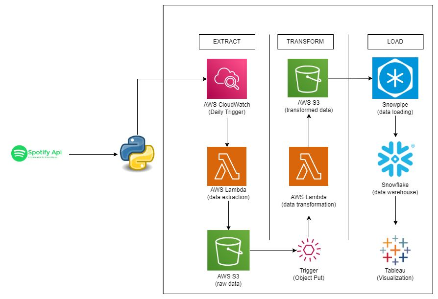

# Spotify Data Pipeline using AWS and Spark

This project involves extracting data from the Spotify API, processing it using AWS services (Lambda, S3, Glue), and loading it into Snowflake for further analysis.

## Overview

1. **Data Extraction**: 
   - Data is extracted from the Spotify API using AWS Lambda.
   - The Lambda function is triggered on a weekly basis.

2. **Data Storage**: 
   - Extracted data is stored in an S3 bucket.

3. **Data Transformation**: 
   - When new data is added to S3, AWS Glue performs transformations using Apache Spark.
   - The transformed data is uploaded to the processed section in S3.

4. **Data Loading**: 
   - New processed data is uploaded to Snowflake.
   - The schema is defined in Snowflake, and SQL queries are written on top of the data for analysis.

## Architecture

1. **AWS Lambda**:
   - Extracts data from the Spotify API.
   - Triggered weekly using CloudWatch Events.

2. **Amazon S3**:
   - Stores raw data extracted from Spotify.
   - Stores processed data after transformations.

3. **AWS Glue**:
   - Performs data transformations using Apache Spark.
   - Triggered when new data is added to S3.

4. **Snowflake**:
   - Stores the final processed data.
   - Allows querying and analysis of the data using SQL.

## Setup Instructions

### Prerequisites

- AWS account with permissions to use Lambda, S3, Glue, and CloudWatch.
- Snowflake account and workspace.

### Step-by-Step Setup

1. **AWS Lambda Function**:
   - Create a Lambda function to extract data from the Spotify API.
   - Set up the Lambda function to trigger weekly using CloudWatch Events.
   - Ensure the Lambda function has the necessary permissions to write to S3.

2. **Amazon S3**:
   - Create an S3 bucket to store raw and processed data.
   - Define two folders in the S3 bucket: `raw/` and `processed/`.

3. **AWS Glue**:
   - Create a Glue job to transform the data using Apache Spark.
   - Define a trigger to start the Glue job when new data is added to the `raw/` folder in S3.
   - Ensure the Glue job writes transformed data to the `processed/` folder in S3.

4. **Snowflake**:
   - Set up a Snowflake database and define the schema for the data.
   - Create an external stage in Snowflake pointing to the `processed/` folder in S3.
   - Use Snowflake's COPY INTO command to load data from S3 to Snowflake.
